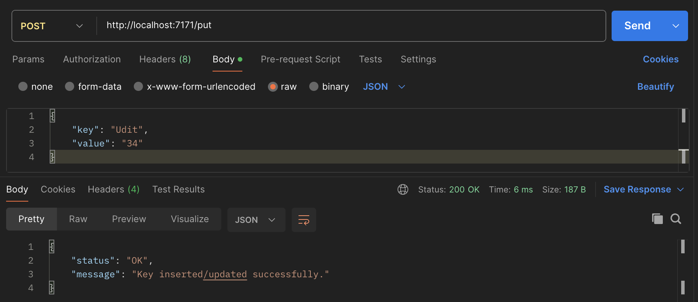
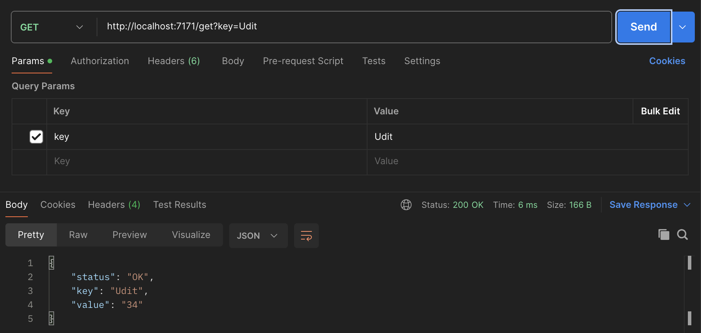
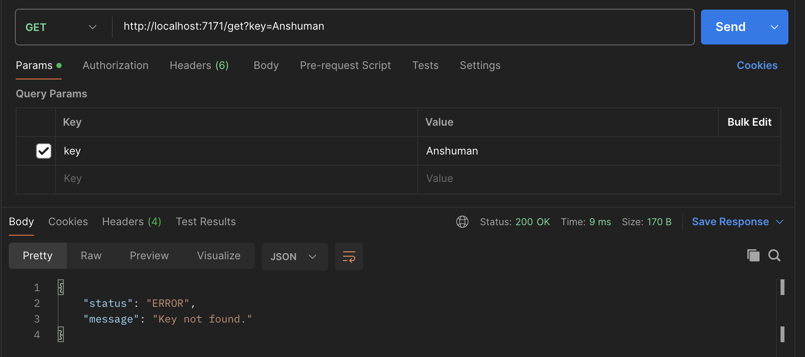

# Key-Value Cache Service  

## Overview  
This project implements an in-memory key-value cache service using FastAPI. The service provides two APIs:  
- **`POST /put`** – Insert or update key-value pairs.  
- **`GET /get`** – Retrieve values by key.  

The service is containerized using Docker and runs on port **7171**.  

## Folder Structure  
```plaintext
kv-cache/
├── app/
│   ├── main.py
│   ├── lru_cache.py
├── images/
├── Dockerfile
├── requirements.txt
├── QnA.md
└── README.md
```

## Setup Instructions 
1. Make sure you have Docker and Docker Compose installed
2. Run the following command to build the Docker image:
```sh
docker build -t kv-cache .
```
3. Execute the following to start the container:
```sh
docker run -p 7171:7171 kv-cache
```

## API Usage 
### 1. Insert/Update a Key-Value Pair 
- **Endpoint:** `POST /put`  
- **Request Body:**  
```json
  {
      "key": "Udit",
      "value": "34"
  }
```
- **cURL Command:**
```sh
curl --location 'http://localhost:7171/put' \
--header 'Content-Type: application/json' \
--data '{
    "key": "Udit",
    "value": "34"
}'
```
- **Example Response:**


If the length of `key` or `value` exceeds 256 characters:
```
{
    "status": "ERROR",
    "message": "Key or value exceeds 256 characters."
}
```

### 2. Get a Value by Key
- **Endpoint:** `GET /get`
- **Query Parameter:** `key`
- **cURL Command:**
```
curl --location 'http://localhost:7171/get?key=Udit'
```
#### Cache-Hit

#### Cache-Miss


